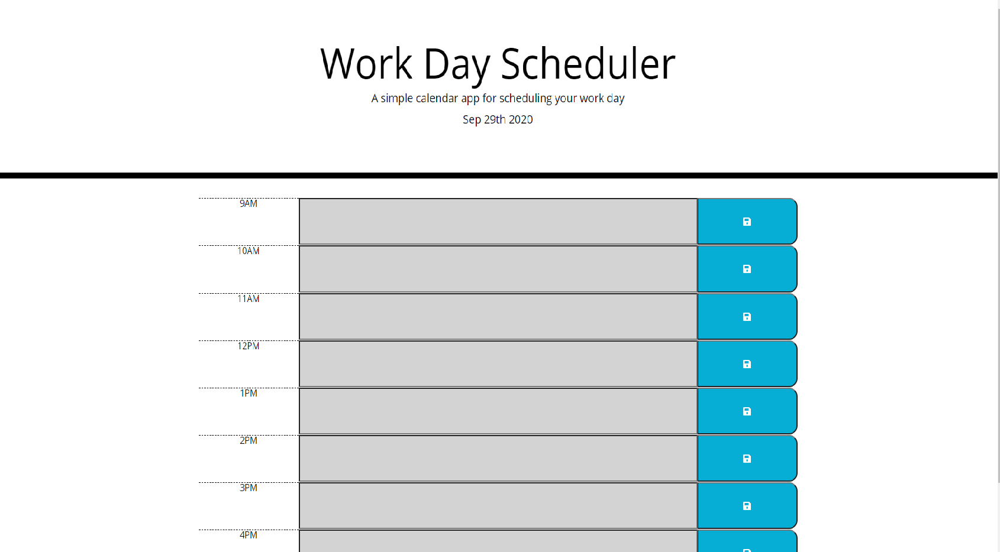

# Day-Planner

## Table of Contents 
1. [Description](#Description)
2. [Installation](#Installation)
3. [Usage](#Usage)
4. [Contributors](#Contributors)
5. [License](#License)

## Description 
As we go throughout our busy days, it can be difficult to keep track of all the things we need to accomplish in the day. Using vanilla javascript, this application was created to ease the need to remember everything that you need to accomplish in the day. 

## Installation 
In order to use this application, check it out [here](https://kelbri10.github.io/Day-Planner/).

## Getting Started 
When the user first enters the application, you are able to type into the text areas next to the corresponding time. As time progresses, the event will turn red if the time matches the present hour. If the time has passed, the event will be grayed out. If the event is upcoming then it will remain green. 

## Contributors 
This project was created by Kelsey Hughes. Check out their [Github Profile](https://github.com/kelbri10).

## License 
This project is Open Source. 